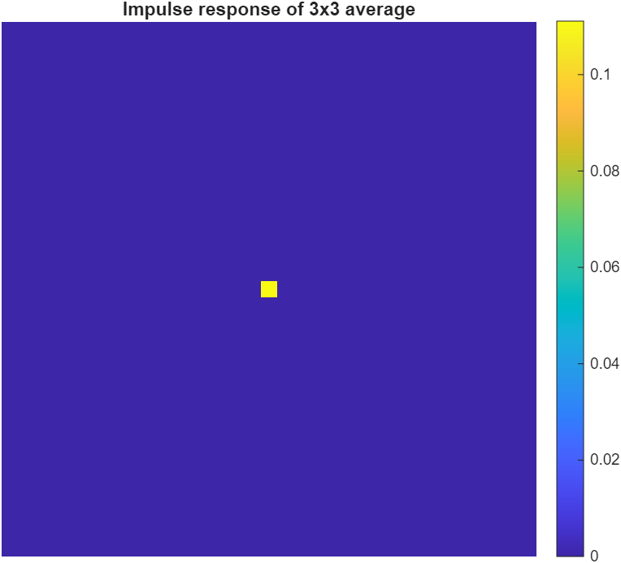
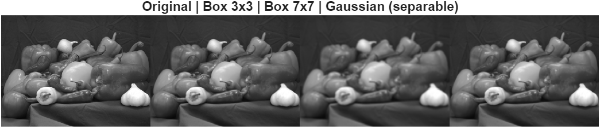
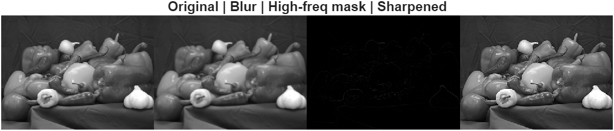
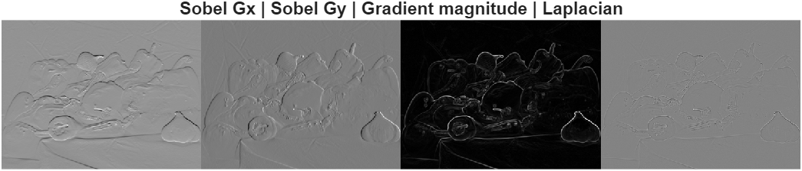

# Lab 2 – 2D Convolution & FIR Filters

This lab explores the concept of **2D convolution** in image processing using FIR (finite impulse response) filters.  
We analyze low-pass and high-pass filters, sharpening, edge detection, and boundary effects.

---

## 1️⃣ Impulse Response Visualization
We create a delta image (an impulse) and convolve it with a 3×3 average filter.  
The result shows the **spatial shape of the filter kernel**.

---

## 2️⃣ Low-Pass Filters: Box vs Gaussian
Comparing 3×3 and 7×7 box filters with a Gaussian kernel.  
- Larger box = stronger blur, but poor frequency response.  
- Gaussian = smoother blur and better frequency behavior.  
- Gaussian is **separable**, allowing faster computation (two 1D filters instead of one 2D).

---

## 3️⃣ Unsharp Masking (Sharpening)
We blur the image, subtract the blurred version (high-frequency mask), and add it back to enhance edges.

Key idea:  
\[
I_{sharp} = I + k (I - I_{blur})
\]

- High-pass filter enhances fine details.  
- Too much gain causes overshoot (halo effect).

---

## 4️⃣ Edge Detection: Sobel & Laplacian
- **Sobel:** Gradient filters (horizontal & vertical) → magnitude map.  
- **Laplacian:** Second derivative → highlights zero-crossings (edges).  

---

## 5️⃣ Correlation vs Convolution
- `conv2` **flips** the kernel.  
- `imfilter(...,'conv')` performs the same flipped operation.  
The difference is numerically near zero.

